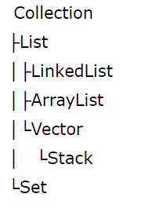

* java.util.Collection是一个**集合接口（集合类的一个顶级接口）**。他提供了对集合对象进行基本操作的通用接口方法。

Collection接口在Java类库中有很多具体的实现。Collection接口的意义是为各种具体的集合提供了最大化的同一操作方法，其直接继承接口有List和Set。



* java.util.Collections是一个包装类（工具类/帮助类）。它包含有各种有关集合操作的静态多态方法。此类不能实例化，就像一个工具类，用于对集合中元素进行排序、搜索以及县城安全等各种操作，服务于Java的Collection框架。

代码示例：

```
import java.util.ArrayList;
import java.util.Collections;
import java.util.List;

public class TestCollections{
    public static void main(String[] args){
        //注意List是实现Collection接口的
        List list = new ArrayList();
        double array[] = {112,111,23,456,231};
        for(int i = 0; i < array.length; i++){
            list.add(new Double(array[i]));
        }
    
        Colections.sort(list);
        for(int i = 0; i<array.length; i++){
            System.out.println(list.get(i));
        }
        //结果:23.0 111.0 112.0 231.0 456.0
    }
}
```

